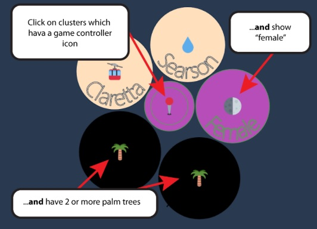

# A Context-Free Method of Visualizing Streaming Object Data for the Purpose of Identifying Known Events: an Implementation and Analysis

My CS Masters thesis hypothesized that multidimensional data can be usefully visualized in a generic fashion. This repository contains the code the supports the implementation done to support the thesis.

To experience the data visualizer from your browser click here >> : https://qcarver.github.io/?FitCsMastersThesis

To read the thesis click here >> : https://repository.lib.fit.edu/handle/11141/2286
